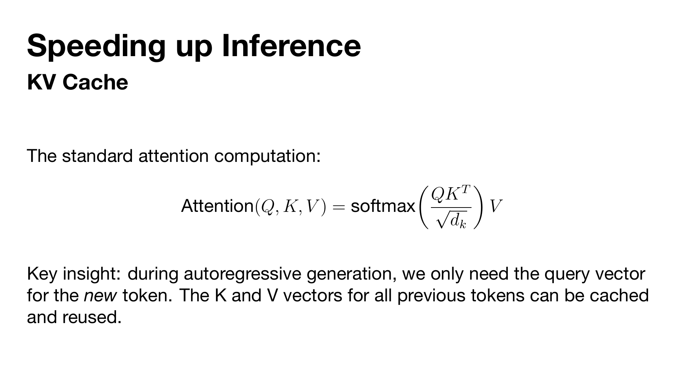

# Minimal Beamer Theme

A clean, Keynote-inspired Beamer theme with bold headings, no navigation chrome, and a white background.



## Usage

```latex
\documentclass[aspectratio=169]{beamer}
\usetheme{minimal}
```

Compile with **XeLaTeX** or **LuaLaTeX** for font support.

## Options

| Option         | Description                                        |
| -------------- | -------------------------------------------------- |
| `inter`        | Use Inter font (default, open-source SF Pro alt)   |
| `helvetica`    | Use Helvetica Neue (macOS only)                    |
| `systemfont`   | Use system sans-serif, no fontspec                 |
| `slidenumbers` | Show slide numbers in the bottom-right             |
| `darktext`     | Use `#1a1a1a` instead of pure black                |

Options can be combined:

```latex
\usetheme[helvetica, slidenumbers, darktext]{minimal}
```

## Diagram Colours

The theme provides a pastel palette for diagrams:

- `m@blue` `#ADD8E6`
- `m@orange` `#FFD599`
- `m@green` `#B7DFB9`
- `m@purple` `#C8B4DC`
- `m@pink` `#F2C4C4`
- `m@yellow` `#FFF2B3`

## Installation

1. Clone this repo or copy `beamerthememinimal.sty` into your project directory (or your local `texmf` tree).
2. If using the `inter` option (default), install [Inter](https://rsms.me/inter/) as a system font.

## Example

See `example.tex` for a working presentation. Build with:

```sh
latexmk -xelatex example.tex
```

## License

MIT
